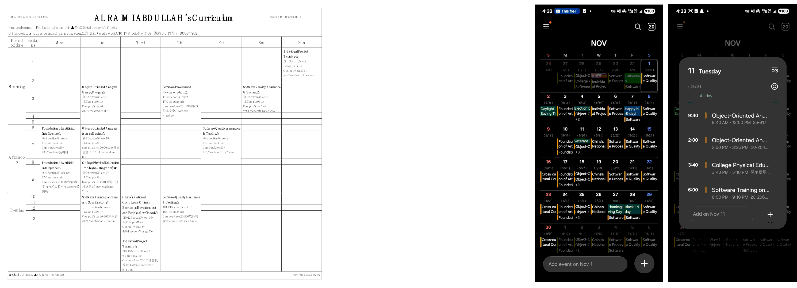
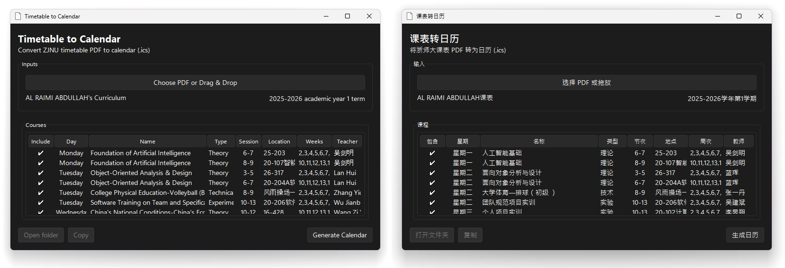

# Timetable to Calendar

<div align="center">

[](https://github.com/Al-rimi/Timetable-to-Calendar/releases)




</div>

Convert ZJNU timetable PDFs (English/Chinese) into standards‑compliant iCalendar (.ics) files that import cleanly into all major calendar apps. Note: extracting courses from PDFs consumes unnecessary CPU/memory and adds failure points. The same page that generates the PDF already has structured timetable data from the database. The efficient solution is to produce the .ics directly from that data.

## Why Calendars, Not Timetables

- Less manual work: add once, see every class automatically.
- Fewer mistakes: time/location changes propagate to calendars.
- Works everywhere: one .ics fits all calendar apps.
- Lower support load for universities: fewer “when/where” questions.

## Downloads

<div align="center">



| Windows | [Download][win-dl]   |
| ------- | -------------------- |
| macOS   | [Download][mac-dl]   |
| Linux   | [Download][linux-dl] |

</div>

<details>
<summary><strong>How to import .ics files</strong></summary>

- **iOS** (Apple Calendar): save the `.ics` to Files, then drag the file into Calendar.
- **Android**: some calendar apps import `.ics` directly just double click. If not, import via web at `calendar.google.com` → Settings → Import, then sync to your phone.
- **Windows** (Outlook/Calendar): double‑click the `.ics` and choose Outlook/Calendar, or Outlook → File → Open & Export → Import/Export → iCalendar (.ics).
- **macOS** (Calendar): double‑click the `.ics` to open in Calendar, or drag it onto the Calendar app.
- **Linux**: open with your calendar app (e.g., GNOME Calendar: File → Import; Thunderbird: File → Open → Calendar File).

</details>

---

Need help or want to improve this project?

- Open an [issue](https://github.com/Al-rimi/Timetable-to-Calendar/issues) for bugs or feature requests.
- Or [Contribute via PRs](https://github.com/Al-rimi/Timetable-to-Calendar/pulls).

See [Changelog](CHANGELOG.md) for updates.

## How It Works

- Input: ZJNU timetable PDF (EN/CN).
- Parse: extract tables and normalize course data.
- Generate: `build_ics` creates RFC 5545‑compliant events with stable UIDs and correct time handling (floating/TZID/UTC). One VEVENT is emitted per week occurrence for maximum importer compatibility.
- Output: a clean `.ics` you can import or subscribe to.

## For Universities

Direct server‑side ICS requires fewer resources and is more reliable than PDF parsing because the structured timetable rows already exist in the same session as the PDF generation. Implement:

- Direct iCalendar export: a “Download .ics” button generated from the same data source used for the PDF.
- Subscription feeds: secure, tokenized `webcal`/HTTPS URLs per user for auto‑updated schedules.
- Minimal mapping: course → VEVENT (summary, location, weekday/section → start/end, weeks → RRULE/EXDATE or one instance per week), stable `UID`, `DTSTAMP`, and consistent timezone handling.

Outcome: no client parsing, lower CPU usage, instant updates across all calendar apps.

<details>
<summary><strong>Technical Details (build_ics)</strong></summary>

Suggested field mapping (server‑side):

- Summary: course name (+ type if needed)
- Location: explicit room/campus; fallback to “Not yet/未定”
- DTSTART/DTEND: computed from weekday + section times (or your canonical schedule)
- Weeks: either `RRULE:FREQ=WEEKLY;BYDAY=...` with selective `EXDATE`s, or pre‑expanded instances (what this tool does)
- UID: stable key such as `<student-id>.<term>.<course-id>-<occurrence>@your-domain`

Tiny example using RRULE/EXDATE (server‑side):

```
BEGIN:VEVENT
UID:20251234.2025-2026-1.CS101-07@calendar.zjnu.edu.cn
DTSTAMP:20240901T000000Z
SUMMARY:CS101 Theory
LOCATION:Main Campus 25-315
DTSTART;TZID=Asia/Shanghai:20250908T080000
DTEND;TZID=Asia/Shanghai:20250908T092500
RRULE:FREQ=WEEKLY;BYDAY=MO;COUNT=16
EXDATE;TZID=Asia/Shanghai:20251006T080000
END:VEVENT
```

Core generation function:

```
build_ics(courses, monday_date, output_path,
          tz="Asia/Shanghai", tz_mode="floating",
          cal_name=None, cal_desc=None,
          uid_domain=None, chinese=False)
```

- Input model: each course dict may include `name`, `day` (`Mon`…`Sun`), `periods` (section numbers), `weeks` (list of week indices), `location`, `teacher`, and optional `outside=True`.
- Time map: section numbers are mapped via `SECTION_TIMES` (08:00–21:10). `monday_date` anchors week 1; dates are derived by weekday + (`week-1`).
- Timezone modes:
  - `floating` (default): writes local wall‑times without `TZID`/`Z` for best cross‑app behavior.
  - `tzid`: writes `DTSTART;TZID=<tz>`/`DTEND;TZID=<tz>` and adds `X‑WR‑TIMEZONE`.
  - `utc`: currently normalized to floating (no trailing `Z`) to keep campus times fixed across clients.
- UID strategy: stable, deterministic UIDs like `class-0001@<domain>`. The CLI derives `<domain>` from student id and term when available; otherwise from a sanitized calendar name. This keeps event identities stable across re‑exports.
- Outside‑of‑table items: scheduled on Sunday starting 14:00, one hour per item; multiple outside items in the same week are placed at 15:00, 16:00, …
- Import robustness: all event descriptions are single‑line; empty in‑table locations become `Not yet/未定`; outside items default to `Online/线上` when no location is present.
- ICS normalization: after serialization, the tool enforces CRLF line endings and injects missing calendar headers: `CALSCALE:GREGORIAN`, `METHOD:PUBLISH`, `X‑WR‑CALNAME`, `X‑WR‑CALDESC`, `X‑WR‑TIMEZONE`. It also ensures each `VEVENT` has a `DTSTAMP` and adjusts `DTSTART/DTEND` to match the selected `tz_mode`.
- Event granularity: no `RRULE`s are used in the generated file; the tool emits one `VEVENT` per week occurrence to maximize compatibility across calendar clients.

</details>

## Quick Start (from source)

- Requirements: Python 3.10+ and `pip`.
- Install:
  ```pwsh
  pip install -r requirements.txt
  ```
- Run GUI:
  ```pwsh
  python gui_win.py
  ```
- Run CLI:
  ```pwsh
  python timetable_to_calendar_zjnu.py
  ```
  The CLI is interactive: it prompts for the PDF path and the Week 1 Monday date, then writes the `.ics` next to the PDF.

## Build

- Create executables with PyInstaller:

  ```pwsh
  # Windows
  pyinstaller --noconfirm gui_win.spec

  # macOS (unsigned app bundle)
  pyinstaller --noconfirm --windowed --name "Timetable to Calendar ZJNU" gui_win.py

  # Linux (install Tk if needed)
  pyinstaller --noconfirm --noconsole --onefile --name "timetable-to-calendar-zjnu" gui_win.py
  ```

Notes:

- Python 3.10+ is required (uses modern type hints like `X | None`).
- On Linux, install Tk runtime (e.g., `sudo apt-get install python3-tk`) before running or building.
- The Windows build uses the provided spec (`gui_win.spec`) and embeds the app icon.

## License & Disclaimer

- MIT License — see [LICENSE](LICENSE).
> Research prototype provided “as is.” Not affiliated with ZJNU.

<!-- Download link references -->

[win-dl]: https://github.com/Al-rimi/Timetable-to-Calendar/releases/download/v0.0.3/Timetable.to.Calendar.ZJNU.exe
[mac-dl]: https://github.com/Al-rimi/Timetable-to-Calendar/releases/download/v0.0.3/Timetable.to.Calendar.ZJNU.app.zip
[linux-dl]: https://github.com/Al-rimi/Timetable-to-Calendar/releases/download/v0.0.3/timetable-to-calendar-zjnu.tar.gz
