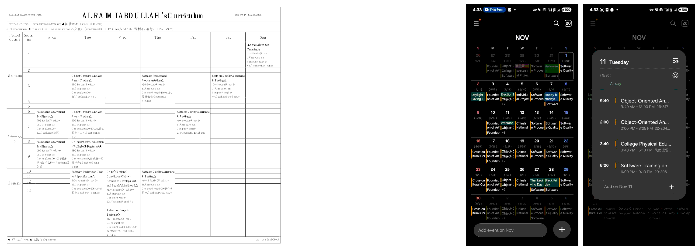

# 课表转日历（Timetable to Calendar）

<div align="center">

[English README](README.md) · [Gitee 镜像](https://gitee.com/al-rimi/Timetable-to-Calendar)

[](https://github.com/Al-rimi/Timetable-to-Calendar/releases)




</div>

将浙师大课表 PDF（中文/英文）转换为标准 iCalendar（.ics）文件，可在各主流日历应用中顺利导入。

## 为什么选择日历而不是课表

- 更少操作：一次添加，整学期自动显示每一节课。
- 更少错误：时间/地点变化后，重新导入即可同步到日历。
- 全平台兼容：一个 .ics 适配几乎所有日历应用。
- 更省心：减少“什么时候/在哪里上课”这类重复咨询。

## 下载

<div align="center">


| Windows | [下载][win-dl]   |
| ------- | ---------------- |
| macOS   | [下载][mac-dl]   |
| Linux   | [下载][linux-dl] |

<p><em>中国大陆用户：建议使用 <a href="https://gitee.com/al-rimi/Timetable-to-Calendar">Gitee 镜像</a> 获取更快的下载速度。</em></p>

</div>

<details>
<summary><strong>如何导入 .ics 文件</strong></summary>

- iOS（苹果日历）：将 `.ics` 保存到“文件”，然后拖入“日历”。
- Android：部分日历可直接打开 `.ics`；若不支持，请在网页端 `calendar.google.com` → 设置 → 导入，然后同步到手机。
- Windows（Outlook/日历）：双击 `.ics` 选择 Outlook/日历，或 Outlook → 文件 → 打开与导出 → 导入/导出 → iCalendar (.ics)。
- macOS（日历）：双击 `.ics` 打开，或拖拽到日历应用。
- Linux：使用你的日历应用导入（如 GNOME 日历：文件 → 导入；Thunderbird：文件 → 打开 → 日历文件）。

</details>

---

需要帮助或想改进此项目？

- 反馈 [Issue](https://github.com/Al-rimi/Timetable-to-Calendar/issues)
- 提交 [Pull Request](https://github.com/Al-rimi/Timetable-to-Calendar/pulls)

更新记录见 [Changelog](CHANGELOG.md)。

## 工作原理

- 输入：浙师大课表 PDF（中/英）。
- 解析：提取表格并规范化课程数据。
- 生成：`build_ics` 输出符合 RFC 5545 的事件，具有稳定 UID 和正确的时间处理（floating/TZID/UTC）。为最大兼容性，每周一次的上课会单独生成一个 VEVENT。
- 输出：干净的 `.ics`，可直接导入或订阅。

## 面向学校的建议

与解析 PDF 相比，服务端直接生成 ICS 更高效可靠，因为 PDF 所用的数据表在同一会话中已存在。建议：

- 直接导出 iCalendar：在课表页面提供“下载 .ics”按钮，由与 PDF 相同的数据源生成。
- 订阅地址：为每位用户提供安全、带令牌的 `webcal`/HTTPS 订阅 URL，可自动更新课表。
- 最小映射：课程 → VEVENT（标题、地点、星期/节次 → 起止时间、周次 → RRULE/EXDATE 或按周展开），稳定 `UID`、`DTSTAMP`，一致的时区处理。

效果：无需客户端解析，服务器负载更低，用户各端日历即时更新。

<details>
<summary><strong>技术细节（build_ics）</strong></summary>

服务端字段映射建议：

- Summary：课程名（必要时附类型）
- Location：具体教室/校区；缺失时回退为“未定/Not yet”
- DTSTART/DTEND：由星期 + 节次时间（或你们的标准作息）计算
- Weeks：可用 `RRULE:FREQ=WEEKLY;BYDAY=...` 并配合 `EXDATE`，或直接按周展开（本工具采用按周展开）
- UID：稳定键，如 `<student-id>.<term>.<course-id>-<occurrence>@your-domain`

使用 RRULE/EXDATE 的极简示例（服务端）：

```
BEGIN:VEVENT
UID:20251234.2025-2026-1.CS101-07@calendar.zjnu.edu.cn
DTSTAMP:20240901T000000Z
SUMMARY:CS101 Theory
LOCATION:Main Campus 25-315
DTSTART;TZID=Asia/Shanghai:20250908T080000
DTEND;TZID=Asia/Shanghai:20250908T092500
RRULE:FREQ=WEEKLY;BYDAY=MO;COUNT=16
EXDATE;TZID=Asia/Shanghai:20251006T080000
END:VEVENT
```

核心函数：

```
build_ics(courses, monday_date, output_path,
          tz="Asia/Shanghai", tz_mode="floating",
          cal_name=None, cal_desc=None,
          uid_domain=None, chinese=False)
```

- 输入模型：每条课程字典可包含 `name`、`day`（`Mon`…`Sun`）、`periods`（节次）、`weeks`（周次列表）、`location`、`teacher`，以及可选 `outside=True`。
- 时间映射：节次通过 `SECTION_TIMES`（08:00–21:10）转换。`monday_date` 对应第 1 周周一；日期由星期 +（`week-1`）推导。
- 时区模式：
  - `floating`（默认）：仅写本地时间，不带 `TZID`/`Z`，跨端表现更稳定。
  - `tzid`：写入 `DTSTART;TZID=<tz>`/`DTEND;TZID=<tz>` 并添加 `X‑WR‑TIMEZONE`。
  - `utc`：当前规范化为 floating（不带 `Z`），以保持校园时间固定。
- UID 策略：如 `class-0001@<domain>` 的稳定、可重复计算的 UID。CLI 在可用时从学号和学期派生 `<domain>`，否则由日历名派生，保证重复导出时事件身份一致。
- 表外条目：安排在周日 14:00 起，每条 1 小时；同周多条依次放在 15:00、16:00 …
- 导入健壮性：事件描述为单行；表内空地点写为 `未定/Not yet`；表外无地点默认 `Online/线上`。
- ICS 规范化：序列化后强制 CRLF 行尾，补全 `CALSCALE:GREGORIAN`、`METHOD:PUBLISH`、`X‑WR‑CALNAME`、`X‑WR‑CALDESC`、`X‑WR‑TIMEZONE`；确保每个 `VEVENT` 具有 `DTSTAMP`，并按所选 `tz_mode` 校正 `DTSTART/DTEND`。
- 事件粒度：不使用 `RRULE` 生成；为最大兼容性，每次上课单独一个 `VEVENT`。

</details>

## 快速开始（源码）

- 需求：Python 3.10+ 与 `pip`。
- 安装：
  ```pwsh
  pip install -r requirements.txt
  ```
- 运行图形界面：
  ```pwsh
  python gui_win.py
  ```
- 运行命令行：
  ```pwsh
  python timetable_to_calendar_zjnu.py
  ```
  CLI 会交互式提示 PDF 路径与“第 1 周周一”日期，并在 PDF 同目录写出 `.ics`。

## 构建（Windows）

快速本地构建，生成带图标与版本信息的 `dist/Timetable to Calendar ZJNU.exe`：

```powershell
# 在仓库根目录
pwsh -NoProfile -ExecutionPolicy Bypass -File .\scripts\build.ps1
```

可选：

- OneDir（便于调试/可能降低误报）：

```powershell
pwsh -NoProfile -ExecutionPolicy Bypass -File .\scripts\build.ps1 -OneDir
```

- 清理并重建：

```powershell
pwsh -NoProfile -ExecutionPolicy Bypass -File .\scripts\build.ps1 -Clean
```

VS Code：终端 → 运行任务 → “Build: Windows (onefile)” 或选择 onedir/clean 变体。

构建脚本将：

- 创建/升级本地虚拟环境 `.venv`
- 安装 `requirements.txt` 与 `pyinstaller`
- 基于 `pyproject.toml` 生成 Windows 版本信息
- 使用 `gui_win.spec` 打包

- macOS（应用包，未签名）：
  ```bash
  pyinstaller --noconfirm --windowed --name "Timetable to Calendar ZJNU" gui_win.py
  ```
- Linux（单文件；需确保 Tk 已安装）：
  ```bash
  sudo apt-get update && sudo apt-get install -y python3-tk
  pyinstaller --noconfirm --noconsole --onefile --name "timetable-to-calendar-zjnu" gui_win.py
  ```

注意

- 需要 Python 3.10+。
- Linux/macOS 需安装 Tk（如 Debian/Ubuntu 的 `python3-tk`）。
- 二进制未签名；首次运行可能弹出系统提示。

## 安全分发（降低杀软/SmartScreen 误报）

- Windows
  - 使用 EV/标准代码签名证书对 EXE 进行签名，有助于建立 SmartScreen 信誉。
  - 避免使用壳/混淆（已禁用 UPX）；保持稳定文件名与内嵌版本信息。
  - 可选：封装为 MSIX 并签名，或通过微软商店分发体验最佳。
  - 如被误拦，提交样本至微软复检：https://www.microsoft.com/wdsi/filesubmission
  - 提供 SHA256 校验：
    ```pwsh
    Get-FileHash "dist/Timetable to Calendar ZJNU.exe" -Algorithm SHA256
    ```
- macOS
  - 使用 Developer ID 签名并公证（`codesign` + `notarytool`），随后粘贴票据（staple）。
  - 分发 `.app`（或签名的 `.dmg`）以避免 Gatekeeper 拦截。
- Linux
  - 提供 `.AppImage` 或 `.tar.gz`，并附带独立签名（GPG 或 `cosign`）与校验和。

这些步骤在开发阶段是可选的，但若要广泛分发可执行文件并尽量避免误报，建议遵循。

## 许可与声明

- MIT License — 参见 [LICENSE](LICENSE)。
  > 研究型原型，按“现状”提供，与浙师大无关。

<!-- 下载链接引用 -->

[win-dl]: https://github.com/Al-rimi/Timetable-to-Calendar/releases/download/1.0.1/Timetable.to.Calendar.ZJNU.exe
[mac-dl]: https://github.com/Al-rimi/Timetable-to-Calendar/releases/download/1.0.1/Timetable.to.Calendar.ZJNU.app.zip
[linux-dl]: https://github.com/Al-rimi/Timetable-to-Calendar/releases/download/1.0.1/timetable-to-calendar-zjnu.tar.gz

## 调试与开发工具

- 命令行始终输出课程摘要：运行 `timetable_to_calendar_zjnu.py` 会打印识别到的课程明细（星期、节次、周次、地点、教师），用于校验解析效果。
- GUI 内联编辑：双击表格可编辑 Day/Session/Weeks/Name/Type/Location/Teacher，生成的 ICS 会反映修改。
- 排序：表格强制按周一 → 周日；如某行星期不对，修改“Day”后会自动重新排序。
- 学期/周一日期：GUI 会对已知学期推断（如 2025‑2026‑1 ⇒ 2025‑09‑08），未知学期会弹日期选择器。
- 主题：检测 Windows 深色模式变化并即时调整 UI。

提示：如需更深入分析，可在 `timetable_to_calendar_zjnu.py`（如 `extract_courses_from_table`）处增加打印并运行 CLI。生成的 `.ics` 统一化了头部、CRLF 行尾，以及每个事件的 `DTSTAMP`，便于对比。

## 测试与排错脚本

`tools/` 下有两份辅助脚本，便于在不启动 GUI 的情况下验证解析与 ICS 输出。

- `tools/debug_extract.py`：单个 PDF 深度分析

  - 功能：打印头部元数据、每个非空单元格的原始内容及切分块、最终解析出的课程（表内+表外），并展示提取的姓名/学号/学期。
  - 运行（PowerShell）：
    ```pwsh
    # 如使用虚拟环境，可先激活
    .\.venv\Scripts\Activate.ps1  # 可选
    python tools/debug_extract.py "samples/AL RAIMI ABDULLAH(2025-2026-1)课表 EN.pdf"
    ```
  - 查找：
    - “-- Extracted --” 的姓名/学号/学期
    - “-- Table cells (non-empty) --” 的块拆分
    - “-- Parsed courses (table) --” 的星期/节次/时间/周次/教师/地点

- `tools/smoke_test.py`：端到端生成烟测
  - 功能：解析样例 PDF，输出简洁课程汇总，并在 `samples/` 下写出（floating time）`.ics`。
  - 运行（PowerShell）：
    ```pwsh
    # 如使用虚拟环境，可先激活
    .\.venv\Scripts\Activate.ps1  # 可选
    python tools/smoke_test.py
    ```
  - 预期输出：形如 `Wrote: samples/AL_RAIMI_ABDULLAH(2025-2026-1)课表_EN.smoke.ics exists: True size: <bytes>` 的结尾行。

提示：若解析异常，请对比原始单元格内容与解析结果，定位拆分/合并规则需要调整之处。

## 通过 pyproject 打包（sdist/wheel）

可使用 `pyproject.toml` 生成可通过 pip 安装的制品：

```pwsh
# 在干净环境
py -3 -m venv .venv
.\.venv\Scripts\Activate.ps1
python -m pip install --upgrade pip build

# 生成源码包与轮子到 dist/
python -m build

# （可选）本地安装测试 CLI 入口
pip install --force-reinstall dist\timetable_to_calendar_zjnu-*.whl

# 现在可运行 pyproject 中定义的脚本：
zjnu-ics        # CLI
zjnu-ics-gui    # GUI
```

以上将使用 `pyproject.toml` 中的 `[project]` 与 `[project.scripts]`，集中维护打包元数据。
